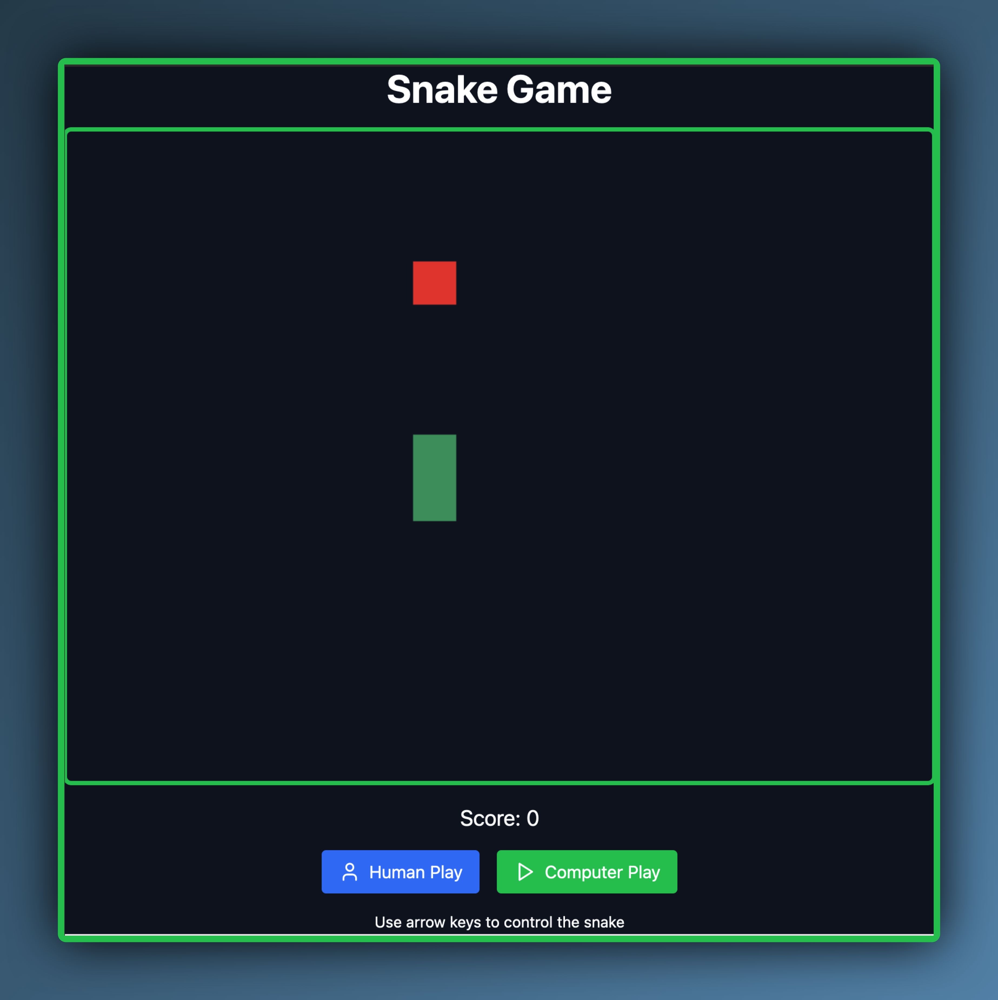

# Snake Game by Claude

A modern implementation of the classic Snake game, built with React and featuring both human and AI play modes. This project showcases interactive gameplay, efficient pathfinding algorithms, and responsive design.



## Features

- Classic Snake gameplay with smooth controls
- AI player using A* pathfinding algorithm
- Switch between human and computer play modes
- Responsive canvas-based rendering
- Score tracking and game over detection
- Modern UI with Tailwind CSS

## Live Demo

[Play the game here](#) <!-- Add your deployed game URL when available -->

## Getting Started

### Prerequisites

- Node.js (v14 or later)
- npm (v6 or later)

### Installation

1. Clone the repository:
   ```
   git clone https://github.com/tarekbadrshalaan/snake_game_by_claude.git
   cd snake_game_by_claude
   ```

2. Install dependencies:
   ```
   npm install
   ```

3. Start the development server:
   ```
   npm start
   ```

4. Open [http://localhost:3000](http://localhost:3000) to view the game in your browser.

## How to Play

- Click "Human Play" to start playing manually:
  - Use arrow keys to control the snake's direction
  - Eat apples to grow and increase your score
  - Avoid running into walls or the snake's own body

- Click "Computer Play" to watch the AI play:
  - The AI uses an A* pathfinding algorithm to navigate efficiently
  - Observe how it balances finding the shortest path with avoiding collisions

- The game ends when the snake collides with a wall or itself
- Try to achieve the highest score possible!

## AI Algorithm

The computer player uses an A* pathfinding algorithm to determine the best path to the apple while avoiding collisions. Key components of the AI include:

- Efficient pathfinding using a priority queue
- Heuristic function to estimate the cost to reach the goal
- Collision avoidance with the snake's body
- Handling of the wraparound game board

## Technologies Used

- React
- HTML5 Canvas
- Tailwind CSS
- Lucide React (for icons)

## Contributing

Contributions are welcome! Please feel free to submit a Pull Request.

## License

This project is licensed under the MIT License - see the [LICENSE](LICENSE) file for details.

## Acknowledgments

- Inspired by the classic Snake game
- AI algorithm based on A* pathfinding
- Created with assistance from Claude, an AI assistant by Anthropic

## Contact

claude.ai with Me - [@tarekbadrsh](https://twitter.com/tarekbadrsh) - info@tarekbadrsh.com

Project Link: [https://github.com/tarekbadrshalaan/snake_game_by_claude](https://github.com/tarekbadrshalaan/snake_game_by_claude)
